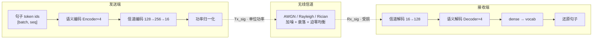
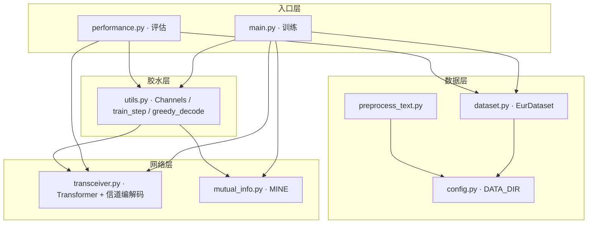
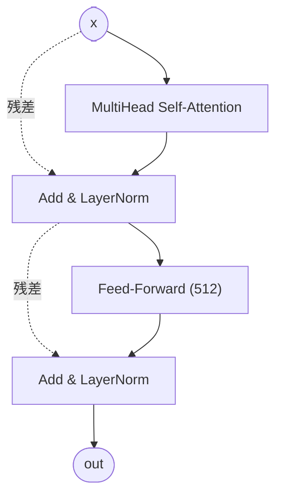
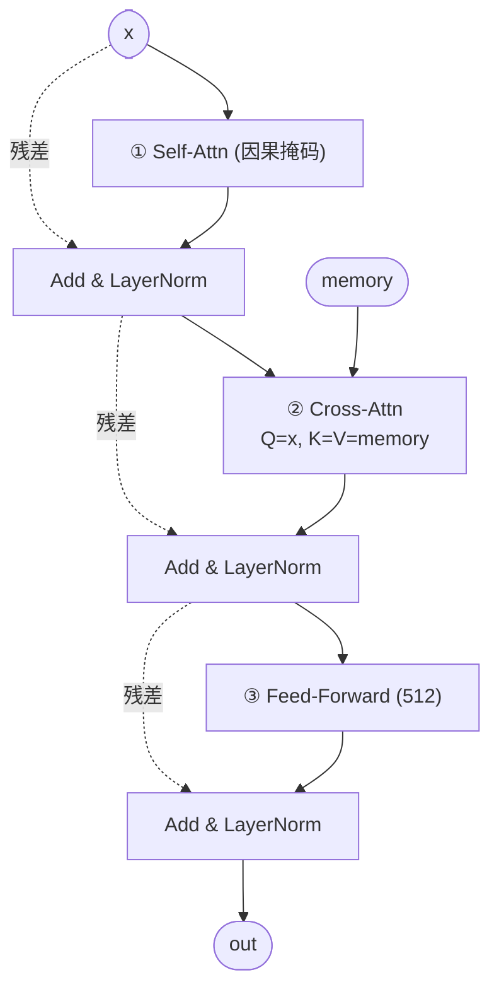
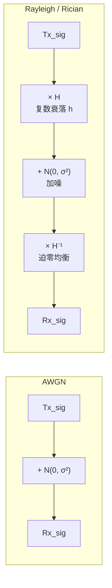
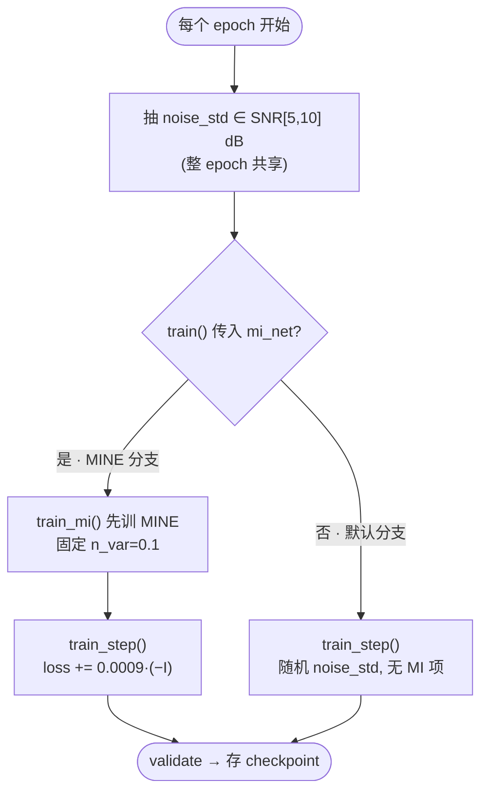

# DeepSC 源码精读笔记

> 目标:从最底层到最顶层,把每一段代码、每一个函数都扒清楚,建立对整个项目的完整心智模型。
> 代码库:PyTorch 实现 "Deep Learning Enabled Semantic Communication Systems" (Xie et al., IEEE TSP 2021)。

> 🔧 **结构重构说明(2026-07-15)**:本笔记正文描述的是**重构前**的平铺布局。代码现已收敛为可安装包 `src/deepsc/`、入口脚本移到 `scripts/`。旧→新映射:
> - `utils.py`(395 行杂物间)拆解 → `deepsc/channels/`(AWGN/Rayleigh/Rician + `apply_channel()` 单一分发)、`deepsc/training/`(engine/losses/optim)、`deepsc/decoding.py`、`deepsc/metrics.py`、`deepsc/signal.py`、`deepsc/models/masking.py`
> - `models/transceiver.py` 拆成 `deepsc/models/transformer.py`(通用 Transformer 块)+ `transceiver.py`(DeepSC 装配)
> - 入口:`main.py`→`scripts/train.py`、`performance.py`→`scripts/evaluate.py`、`preprocess_text.py`→`scripts/preprocess.py`;`dataset.py`+`SeqtoText`→`deepsc/data/`;`config.py`→`deepsc/config.py`(3 处重复的 `device` 全局也收敛到此)
> - 4 处硬编码 `if channel==...` 已合并为单一 `apply_channel(name, tx, n_var)`,将来加 A2G 信道只需 `register("A2G", A2G())`,不动任何调用点
> - ⚠️ 下面正文里的 `src/xxx.py#L行号` 链接是**重构前的历史路径**(清理代码后行号也已过时);**函数名与行为描述仍然准确**,文件位置以上面映射为准。

---

## 目录

- [Part 0 · 全景地图](#part-0--全景地图)
- [Part 1 · 数据层](#part-1--数据层原始文本--batch-tensor)
- [Part 2 · 网络层](#part-2--网络层模型的心脏)
- [Part 3 · 胶水层](#part-3--胶水层utilspy-把数据和网络焊在一起)
- [Part 4 · 入口层](#part-4--入口层训练与评估)
- [Part 5 · 完整训练动力学串联](#part-5--完整训练动力学把所有层串起来)
- [附录 A · 关键超参表](#附录-a--关键超参表)
- [附录 B · 遗留代码与陷阱清单](#附录-b--遗留代码与陷阱清单必读)
- [附录 C · 评估指标:BLEU 与 BERT](#附录-c--评估指标bleu-与-bert)

---

## Part 0 · 全景地图

### 0.1 这篇论文在干什么

传统通信传的是**比特/符号**,目标是"bit 准确"(Shannon 那一套)。DeepSC 传的是**语义**:发一句英文,经过有噪声的信道,收端不追求逐 bit 一致,而是追求"意思还原"(用 BLEU 衡量)。

为此它把 **Transformer 语义编解码器 + 信道编解码器** 串成一条端到端的管道一起训练;另外挂一个 **MINE 互信息网络** 作为正则,逼着信道编码器产出"扛得住信道"的信号(JSCC 联合信源信道编码思想)。

### 0.2 一次前向传播的数据流(文本 → 文本)

```
句子 [batch, seq]  (token id 序列,含 <START>/<END>)
   │  ─────────── 语义编码器 (Transformer Encoder, 4 层) ───────────
   ▼
语义编码 enc_output        [batch, seq, 128]    ← 提取"意思"
   │  ─────────── 信道编码器 (Linear 128→256→16) ───────────
   ▼
channel_enc_output         [batch, seq, 16]     ← 压成 16 维"待发信号"
   │  PowerNormalize (功率归一化到 ≤1,保证 SNR 有定义)
   ▼
Tx_sig  ═══════════ 信道 AWGN / Rayleigh / Rician ═══════════  Rx_sig
                          (加噪 + 衰落 + 迫零均衡)
   │  ─────────── 信道解码器 (ChannelDecoder: 16→128, 残差 MLP) ───────────
   ▼
channel_dec_output         [batch, seq, 128]    ← 从受损信号里恢复
   │  ─────────── 语义解码器 (Transformer Decoder, 4 层) ───────────
   ▼
dec_output  →  dense(128→vocab)  →  pred logits  →  还原句子
```



侧挂的 **MINE 网络**:估算发送 Tx 与接收 Rx 之间的互信息 I(Tx;Rx),以 `loss += 0.0009 · (−I(Tx;Rx))` 加入损失。
> ⚠️ **重要**:在当前 `main.py` 的训练入口里,MINE 其实被**关闭**了(见附录 B-1)。默认训练 = 纯 masked-CE 自编码 + 随机 SNR 训练。

### 0.3 一个关键设计(容易漏)

`DeepSC` 这个类 **没有 `forward()` 方法**([transceiver.py:263](../src/models/transceiver.py#L263))。
整条前向流是在 `utils.py` 的 `train_step / val_step / greedy_decode` 里**手动编排**的。"模型"其实是个装子模块的容器,数据流写死在训练函数里。

### 0.4 包结构(重构后;依赖方向:上依赖下)

```
入口层    scripts/train.py(训练)  scripts/evaluate.py(评估)  scripts/quick_eval.py
            │                         │
胶水层    deepsc/training/engine.py   deepsc/decoding.py
          (train_step/val_step/train_mi)   (greedy_decode)
            └── 两处都调 apply_channel(name, tx, n_var) ──┐
            │                                            │
信道层    ◀──────── deepsc/channels/(AWGN/Rayleigh/Rician + 分发) ──┘
            │
网络层    deepsc/models/  transformer.py(通用块)+ transceiver.py(DeepSC)+ mutual_info.py(MINE)
            │
数据层    deepsc/data/dataset.py(EurDataset/SeqtoText) · scripts/preprocess.py · deepsc/config.py(DATA_DIR+device)
```



阅读顺序就按 **数据层 → 网络层 → 胶水层 → 入口层**。

---

## Part 1 · 数据层(原始文本 → batch tensor)

回答一个问题:**一句话是怎么变成模型输入的?** 一条流水线:

```
raw europarl/*.txt  ──preprocess_text.py──▶  vocab.json + train_data.pkl + test_data.pkl
                                                         │
                                                 dataset.py (EurDataset + collate_data)
                                                         │
                                                         ▼
                                             [batch, max_len] 的 int64 tensor
```

### 1.1 `config.py` — 全项目唯一的环境入口

```python
load_dotenv()                                        # 读项目根的 .env
DATA_DIR = os.environ.get('DATA_DIR', '.../hx301/')  # 默认值是原作者机器的路径
```

整个项目凡是要找数据的地方,都 `from config import DATA_DIR`。重构时把散落 4 个文件的硬编码绝对路径收敛到了这里。16 行,没有别的。

### 1.2 `preprocess_text.py` — 语料预处理(离线跑一次)

输入:Europarl 语料(欧洲议会平行语料,一堆 `.txt`)。输出:`vocab.json` + 两个 `.pkl`。**只在训练前跑一次。**

**特殊 token 预留**([L31](../src/preprocess_text.py#L31)):
```python
SPECIAL_TOKENS = {'<PAD>':0, '<START>':1, '<END>':2, '<UNK>':3}
```
前 4 个 id 永远是这四个,真实单词从 id=4 开始。

**逐函数:**

| 函数 | 行 | 作用 |
|---|---|---|
| `unicode_to_ascii` | [L38](../src/preprocess_text.py#L38) | NFD 规范化后扔掉 `Mn` 类字符(变音/重音标记)。`café→cafe`、`naïve→naive`。 |
| `normalize_string` | [L42](../src/preprocess_text.py#L42) | 5 步清洗:① ascii 折叠 ② 去 XML 标签 ③ 在 `!?.` 前插空格 ④ 只保留 `a-zA-Z.!?` 其余替成空格 ⑤ 压缩连续空格 ⑥ 小写。 |
| `cutted_data` | [L55](../src/preprocess_text.py#L55) | 按**词数**过滤,保留 `4 < 词数 < 30` 的句子(严格不等号)。太短没语义、太长塞不进 batch。 |
| `process` | [L68](../src/preprocess_text.py#L68) | 读一个 `.txt` → 按行切 → 逐行 `normalize_string` → `cutted_data`,返回干净句子列表。 |
| `tokenize` | [L79](../src/preprocess_text.py#L79) | 字符串 → token 列表。`punct_to_keep` 的标点前插空格使其独立成 token;`punct_to_remove` 直接删;默认首尾加 `<START>`/`<END>`。 |
| `build_vocab` | [L102](../src/preprocess_text.py#L102) | 统计词频,**在 `SPECIAL_TOKENS` 基础上**给每个出现 ≥1 次的词分配 id(所以从 4 开始)。 |
| `encode` / `decode` | [L122](../src/preprocess_text.py#L122) / [L134](../src/preprocess_text.py#L134) | 词↔id 互转。⚠️ **这两个在 `main()` 里没被调用**(main 内联了同样逻辑),属遗留代码。 |

**`main()` 真实流程**([L146](../src/preprocess_text.py#L146)):

1. 所有路径前面拼 `DATA_DIR`;
2. 遍历 `europarl/en/*.txt`,每个 `process()` 一遍,句子累加;
3. **去重**(dict 计数后取 keys);
4. `build_vocab(sentences, SPECIAL_TOKENS, punct_to_keep=[';', ','], punct_to_remove=['?', '.'])`
   → 分号、逗号**保留为独立 token**;问号、句号**直接删掉**;`<START>/<END>` 由 tokenize 自动加;
5. 存 `vocab.json = {'token_to_idx': {...}}`;
6. 逐句 `tokenize`(带 start/end)→ 查表转 id 列表 → **每条存进 pkl 的句子 = `[1, ...单词id..., 2]`**(`1=<START>`,`2=<END>`);
7. **9:1 切分** → `train_data.pkl` / `test_data.pkl`(都是"变长 id 列表"的 list)。

> **结论**:两个 pkl 存的是**变长、首尾带 START/END 的 token-id 列表**;词表第 0~3 号是特殊符,真实单词从 4 号起。

### 1.3 `dataset.py` — 把 pkl 变成 batch tensor

**`EurDataset(Dataset)`**([L16](../src/dataset.py#L16)):
```python
def __init__(self, split='train'):
    with open(DATA_DIR + f'europarl/{split}_data.pkl', 'rb') as f:
        self.data = pickle.load(f)   # list,每个元素是一条句子的 id 列表
def __getitem__(self, index): return self.data[index]
def __len__(self): return len(self.data)
```
pkl 的薄封装。

**`collate_data(batch)`**([L30](../src/dataset.py#L30))—— 干活的是它,被 `DataLoader(collate_fn=...)` 调用:
```python
max_len = max(len(x) for x in batch)        # 本 batch 最长句子
sents = np.zeros((batch_size, max_len))     # 用 0 填充, 0 = <PAD>
sort_by_len = sorted(batch, key=len, reverse=True)  # 按长度降序
for i, sent in enumerate(sort_by_len):
    sents[i, :len(sent)] = sent             # 左对齐, 右边补 <PAD>
return torch.from_numpy(sents)              # [batch, max_len] int64
```

三件事:① 短句右侧补 `<PAD>=0` 凑齐到 `max_len`,变矩形张量;② 按长度降序排(RNN 时代 `pack_padded_sequence` 的遗留习惯,Transformer 靠 mask 处理 padding,排序其实非必需,但无害);③ 转 tensor。

> **结论**:网络看到的输入永远是 `[batch, max_len]` 的整数张量,短句末尾是 0;下游靠 mask 知道哪些是 padding。

---

## Part 2 · 网络层(模型的心脏)

两个文件:`models/transceiver.py`(Transformer 全家桶 + 信道编解码)、`models/mutual_info.py`(MINE 互信息估计)。

### 2.1 `transceiver.py` — Transformer + 信道编解码

#### `PositionalEncoding`([L27](../src/models/transceiver.py#L27))
Transformer 没有递归,需要把"位置"显式编码进向量。用正弦/余弦:
```python
pe[:, 0::2] = sin(position · div_term)   # 偶数维用 sin
pe[:, 1::2] = cos(position · div_term)   # 奇数维用 cos
# div_term = exp(arange(0,d,2) · −log(10000)/d)
```
`register_buffer('pe', pe)` → 它不是参数(不更新),但随模型一起搬到 GPU、一起存 checkpoint。前向里 `x = x + pe[:, :seq_len]` 再 dropout。

#### `MultiHeadedAttention`([L48](../src/models/transceiver.py#L48))
多头缩放点积注意力。核心两个方法:

- `forward(query, key, value, mask)`([L67](../src/models/transceiver.py#L67)):
  1. 对 Q/K/V 各做一次线性映射 `wq/wk/wv`(d_model→d_model);
  2. reshape 成 `[batch, seq, num_heads, d_k]` 再 transpose 到 `[batch, num_heads, seq, d_k]`(拆头);
  3. 调 `self.attention(...)`;
  4. 把多头拼回 `[batch, seq, d_model]`,过最后一层 `dense` + dropout。
  - `d_k = d_model // num_heads`(默认 128/8=16)。

- `attention(query, key, value, mask)`([L100](../src/models/transceiver.py#L100)) —— 缩放点积本体:
  ```
  scores = Q·Kᵀ / √d_k
  if mask: scores += mask · (−1e9)     # mask=1 的位置 softmax 后→0(屏蔽)
  p_attn = softmax(scores, dim=-1)
  output  = p_attn · V
  ```
  > ⚠️ **mask 语义**:这个实现里 `mask=1` 表示"屏蔽该位置"。记牢这个约定,后面 `create_masks` 全靠它。

#### `PositionwiseFeedForward`([L113](../src/models/transceiver.py#L113))
两层线性 + ReLU + dropout:`FFN(x) = W₂·ReLU(W₁·x)`,中间维 `dff=512`。

#### `EncoderLayer`([L143](../src/models/transceiver.py#L143))
标准 Transformer encoder block(Post-Norm):
```
x → MultiHeadSelfAttn(x,x,x,mask) → Add & LayerNorm → FFN → Add & LayerNorm → out
```



#### `DecoderLayer`([L165](../src/models/transceiver.py#L165))
两个注意力 + FFN,三个 Add&LayerNorm:
```
x → SelfAttn(x,x,x, look_ahead_mask) → Add&LN            # 因果自注意(不能看未来)
  → CrossAttn(x, memory, memory, src_pad_mask) → Add&LN  # 与编码器输出交互
  → FFN → Add&LN → out
```
`memory` = 语义解码器视角的"信道解码器输出"(代替普通 Transformer 的 encoder output)。



#### `Encoder`([L194](../src/models/transceiver.py#L194)) / `Decoder`([L219](../src/models/transceiver.py#L219))
- `Encoder`:Embedding(vocab→d_model) → `× √d_model` 缩放 → 位置编码 → 堆 N 个 `EncoderLayer`。
- `Decoder`:结构对称,堆 N 个 `DecoderLayer`,`forward(x, memory, look_ahead_mask, trg_pad_mask)`。
- N = `num_layers` = 4。

> **注意 `× √d_model`**([L209](../src/models/transceiver.py#L209)):embedding 后乘 √128,让嵌入向量量级与位置编码匹配,否则 PE 会盖过词义。

#### `ChannelDecoder`([L241](../src/models/transceiver.py#L241))
接收端信道解码器,**带残差连接**的三层 MLP:
```
x → Linear(16→d_model) ──┐                      # x1
   → ReLU → Linear(d_model→512) → ReLU           # 压到瓶颈再扩
   → Linear(512→d_model) ──────────────────────  # x5
out = LayerNorm(x1 + x5)                         # 残差: 浅层线性 + 深层非线性
```
残差让原始特征不丢;瓶颈维 512 强化"从受损信号重建"的能力。

> 注意:信道**编码**器是 `DeepSC` 里的 `nn.Sequential`(见下),信道**解码**器才是这个 `ChannelDecoder` 类。命名有点不对称。

#### `DeepSC`([L263](../src/models/transceiver.py#L263)) — 顶层容器
把以上部件拼起来:
```python
self.encoder          = Encoder(...)                 # 语义编码
self.channel_encoder  = nn.Sequential(               # 信道编码: 128→256→16
                           nn.Linear(d_model, 256), ReLU, nn.Linear(256, 16))
self.channel_decoder  = ChannelDecoder(16, d_model, 512)  # 信道解码: 16→128
self.decoder          = Decoder(...)                 # 语义解码
self.dense            = nn.Linear(d_model, trg_vocab) # 输出投影到词表
```
**没有 `forward()`**。前向流写死在 `utils.py` 的训练函数里(见 Part 3.6)。

### 2.2 `mutual_info.py` — MINE 互信息估计

DeepSC 用 **MINE**(Belghazi et al., 2018)用神经网络估计互信息的下界。

#### `Mine` 网络([L14](../src/models/mutual_info.py#L14))
一个 3 层 MLP:`(in_dim=2) → 10 → 10 → 1`,ReLU 激活。输入是 `(Tx_i, Rx_i)` 这种**成对标量对**,输出一个标量 `T(x)`(见 `linear` 里的特殊初始化:权重用 `N(0, 0.02)`,偏置清零)。

#### `sample_batch(rec, noise)`([L62](../src/models/mutual_info.py#L62))
把 Tx 和 Rx 各自展平成长向量,各自对半切:
```python
joint    = (Tx_前半, Rx_前半)   # 真实配对 → 服从联合分布 p(Tx,Rx)
marginal = (Tx_前半, Rx_后半)   # 错位配对 → 服从边缘乘积 p(Tx)·p(Rx)
```
"错位配对"是为了造出**边缘分布**的样本(两者独立)。

#### `mutual_information(joint, marginal, net)`([L40](../src/models/mutual_info.py#L40))
**Donsker–Varadhan 下界**:
```
Î(X;Y) = E_joint[T(x)] − log E_marg[exp(T(x))]
```
理论上 I(X;Y) = sup_T 这个表达式。MINE 训练 `T=Mine` 去逼近上界,使估计变紧。返回 `(mi_lb, t, et)`。

#### `learn_mine`([L47](../src/models/mutual_info.py#L47))
带**滑动平均去偏**的版本(`ma_et`)。⚠️ 当前 `main.py` **没用它**,用的是 `train_mi` 里的**有偏估计**(`loss = −mi_lb` 直接)。属可选的改进路径。

---

## Part 3 · 胶水层(`utils.py`:把数据和网络焊在一起)

这个文件最杂,但最关键。按功能分组讲。

### 3.1 设备
```python
device = torch.device("cuda:0" if torch.cuda.is_available() else "cpu")
```
全局变量,到处 `.to(device)`。在 macOS 上会落到 CPU(`cuda:0` 不可用);想用 MPS 得自己改。

### 3.2 评估工具
- **`BleuScore`**([L20](../src/utils.py#L20)):封装 `nltk.sentence_bleu`,支持 1~4-gram 权重。评估时用 `BleuScore(1,0,0,0)` = 只看 1-gram(BLEU-1)。
- **`SeqtoText`**([L129](../src/utils.py#L129)):id → 句子。内部建反向词表 `idx→word`,遇到 `<END>` 停。评估时把解码出的 id 序列变回文本算 BLEU。

### 3.3 信道模型 `Channels`([L146](../src/utils.py#L146)) ⭐(UAV 改造的落点)

```python
class Channels():
    def AWGN(self, Tx_sig, n_var):       # 加性高斯白噪
    def Rayleigh(self, Tx_sig, n_var):   # 瑞利衰落
    def Rician(self, Tx_sig, n_var, K=1):# 莱斯衰落(有直射径)
```

**`AWGN`**([L148](../src/utils.py#L148)):`Rx = Tx + N(0, n_var)`。最简单的加噪。

**`Rayleigh`**([L152](../src/utils.py#L152)):用 2×2 实矩阵实现**复数基带衰落**:
```python
H_r, H_i ~ N(0, √(1/2))                          # 复增益 h = H_r + j·H_i
H = [[H_r, −H_i], [H_i, H_r]]                    # ← 复数乘法的实矩阵表示
Tx_sig([..., 2]) @ H                              # 对每个 I/Q 对施加衰落 h
Rx = AWGN(Tx·H, n_var)                           # 再加噪
Rx = Rx · H⁻¹                                    # 迫零(ZF)均衡
```
> 数学:`[[a,−b],[b,a]]·[x;y] = [ax−by; bx+ay]` 正好是 `(a+jb)(x+jy)` 的实/虚部。
> E[|h|²]=1/2+1/2=1(单位功率衰落)。ZF 均衡后 `Rx = Tx + H⁻¹·N`,噪声被 `1/|h|` 放大 —— 深衰落时炸掉,这就是衰落信道比 AWGN 差的根源。

**`Rician`**([L164](../src/utils.py#L164)):结构同 Rayleigh,但 LoS 直射径让均值非零:
```python
mean = √(K/(K+1))   # LoS 分量幅度
std  = √(1/(K+1))   # 散射分量
H_r, H_i ~ N(mean, std)        # 实虚部都带同一个正均值
```
K = 直射/散射功率比。K→0 退化为类 Rayleigh;K 越大越接近确定性直射径(信道越好)。
> ⚠️ 此处实虚部共用同一正均值,与教科书 Rician 略有出入,但作为"带 LoS 增益的衰落信道"足够用。日后换 UAV 信道时,改的就是这个类。



### 3.4 掩码
- **`subsequent_mask(size)`**([L185](../src/utils.py#L185)):`np.triu(ones, k=1)` → 上三角(不含对角)为 1,表示"未来位置"。解码时防偷看未来。
- **`create_masks(src, trg, pad)`**([L193](../src/utils.py#L193)):
  ```
  src_mask      = (src==pad)  → [batch,1,seq]   # 1=padding,要屏蔽
  trg_pad_mask  = (trg==pad)
  look_ahead    = subsequent_mask(trg_len)
  combined_mask = max(trg_pad_mask, look_ahead)  # padding 或未来 都屏蔽
  ```

### 3.5 数值工具
- **`SNR_to_noise(snr)`**([L222](../src/utils.py#L222)):`snr(dB) → noise_std`。
  ```
  snr_lin = 10^(snr/10);  noise_std = 1/√(2·snr_lin)
  ```
  因子 2:复信道有 I/Q 两个实维度,每维方差 σ²,总噪声方差 2σ²=1/SNR=N₀(配合单位信号功率)。
- **`PowerNormalize(x)`**([L212](../src/utils.py#L212)):若 RMS 功率 `√mean(x²)>1`,则除以它 → 功率封顶 1。保证发射信号单位功率,SNR 才有物理意义。
- **`loss_function(x, trg, pad, criterion)`**([L203](../src/utils.py#L203)):**带 padding 掩码的交叉熵**。先算逐 token CE(`reduction='none'`),再乘 `mask=(trg!=pad)` 把 padding 位置清零,最后取均值。
- **`initNetParams`**([L178](../src/utils.py#L178)):对维度>1 的参数做 **Xavier 均匀初始化**。

### 3.6 训练/推理函数(前向流的真正所在)

> 三个函数 `train_step / val_step / greedy_decode` 共享同一段前向编码:语义编码 → 信道编码 → 功率归一 → 信道 → 信道解码 → 语义解码。**信道派发 `if channel=='AWGN' ...` 在 4 处重复**,这正是未来要重构 + 加 UAV 的地方(见附录 B-3)。

**`train_step`**([L228](../src/utils.py#L228)) —— 一个训练步:
1. `trg_inp = trg[:, :-1]`,`trg_real = trg[:, 1:]`(**teacher forcing 位移**):输入去掉末 token,目标去掉首 token。
2. `create_masks` → `src_mask`, `look_ahead_mask`;
3. `enc_output = encoder(src, src_mask)` → 语义编码;
4. `channel_enc_output = channel_encoder(enc_output)` → 128→16;
5. `Tx_sig = PowerNormalize(...)` → 功率归一;
6. **信道派发** → `Rx_sig`;
7. `channel_dec_output = channel_decoder(Rx_sig)` → 16→128;
8. `dec_output = decoder(trg_inp, channel_dec_output, look_ahead_mask, src_mask)`;
9. `pred = dense(dec_output)` → 词表 logits;
10. `loss = loss_function(pred, trg_real, pad, criterion)`(masked CE);
11. **若 `mi_net` 非空**:`mi_net.eval()` 算 `mi_lb`,`loss += 0.0009 · (−mi_lb)`(鼓励 Tx/Rx 高互信息);
12. `loss.backward(); opt.step()`,返回 `loss.item()`。

> 在 `main.py` 里 `train_step(net, sents, sents, ...)` —— **src 和 trg 是同一句话**。所以 DeepSC 训练本质是"句子经噪声信道的自编码重建",不是翻译。

**`train_mi`**([L280](../src/utils.py#L280)) —— 单独训练 MINE 网络:
同样的"编码+信道"走到 Tx/Rx → `sample_batch` → `mutual_information` → `loss = −mi_lb` → 反传(梯度裁剪 10.0)。目的:让 MINE 把互信息估计得更准。

**`val_step`**([L308](../src/utils.py#L308)):`train_step` 去掉反传和 MI 项,返回 loss。

**`greedy_decode`**([L341](../src/utils.py#L341)) —— 贪心自回归推理(评估用):
1. src 经"语义编码+信道编码+功率归一+信道+信道解码"得到 `memory`;
2. 初始化输出为 `[<START>]`;
3. 循环 `max_len−1` 次:当前输出过 decoder + dense,取**最后一位** logits 的 argmax 作为下一个词,拼到输出末尾;
4. 返回 `[batch, max_len]` 的 id 序列。
> 注释里提到:想要更好性能可换 beam search。

### 3.7 遗留(定义了但当前入口没用)
- **`LabelSmoothing`**([L37](../src/utils.py#L37)):标签平滑交叉熵。当前用 `nn.CrossEntropyLoss`,**未启用**。
- **`NoamOpt`**([L64](../src/utils.py#L64)):"Attention is all you need" 的 warmup 学习率调度。当前用 Adam 定常 lr=1e-4(`NoamOpt` 那行被注释),**未启用**。且其 `weight_decay()` 最后被 `=0` 覆盖,恒返回 0。

---

## Part 4 · 入口层(训练与评估)

### 4.1 `main.py` — 训练入口

**参数**([L23](../src/main.py#L23)):`--channel`(默认 Rayleigh)、`--d-model 128`、`--dff 512`、`--num-layers 4`、`--num-heads 8`、`--batch-size 128`、`--epochs 80`、`--checkpoint-path checkpoints/deepsc-Rayleigh`。

**`setup_seed`**([L40](../src/main.py#L40)):固定 torch/cuda/numpy/random/cudnn 种子,可复现。入口处被注释掉了(`# setup_seed(10)`)。

**`validate`**([L47](../src/main.py#L47)):test 集跑 `val_step`(**固定 n_var=0.1**),返回平均 loss。

**`train`**([L70](../src/main.py#L70)):
```python
noise_std = np.random.uniform(SNR_to_noise(5), SNR_to_noise(10), size=(1))  # 每个epoch抽1次
for sents in pbar:
    if mi_net is not None:   # MINE 分支: 固定 n_var=0.1, 先训MINE再训DeepSC
        mi    = train_mi(net, mi_net, sents, 0.1, pad_idx, mi_opt, channel)
        loss  = train_step(net, sents, sents, 0.1, pad_idx, optimizer, criterion, channel, mi_net)
    else:                    # 默认分支: 用随机 noise_std, 不带MI
        loss  = train_step(net, sents, sents, noise_std[0], pad_idx, optimizer, criterion, channel)
```
> ⚠️ **每个 epoch 只抽一次 `noise_std`**(在 batch 循环外),全 epoch 共享。这是"随机 SNR 训练"让模型对不同 SNR 鲁棒,但采样粒度是 per-epoch 而非 per-batch。

**`__main__` 流程**([L100](../src/main.py#L100)):
1. 读 vocab → 拿到 `num_vocab`、`pad_idx/start_idx/end_idx`;
2. 建 `DeepSC(...).to(device)` + `Mine().to(device)`;
3. 损失:`nn.CrossEntropyLoss(reduction='none')`;
4. 优化器:DeepSC 用 Adam(lr=1e-4, betas=(0.9,0.98), weight_decay=5e-4);MINE 用 Adam(lr=1e-3);
5. `initNetParams(deepsc)`(Xavier 初始化);
6. 循环 80 epoch:`train` → `validate` → 存 checkpoint。

### 4.2 `performance.py` — 评估入口(BLEU vs SNR)

**`performance(args, SNR, net)`**([L99](../src/performance.py#L99)):
1. `BleuScore(1,0,0,0)`(BLEU-1)、`SeqtoText`(id→文本);
2. 对 `SNR=[0,3,6,9,12,15,18]` dB 每个点:把 test 集每句 `greedy_decode` 成文本,与原句算 BLEU;
3. 每个 SNR 取句均 BLEU,返回 **BLEU–SNR 曲线**(7 个数)。
> 句子相似度(BERT)那段 `Similarity` 被**注释掉了**,所以默认只出 BLEU。

**`__main__`**([L160](../src/performance.py#L160)):建模型 → 扫 `checkpoint_path` 下所有 `.pth`,按文件名里的 epoch 号排序 → **取最大 epoch 的那个**(不一定是 loss 最低)→ `load_state_dict` → 跑 `performance` → 打印曲线。

---

## Part 5 · 完整训练动力学(把所有层串起来)

### 5.1 一个 batch 的完整生命周期

```
1. DataLoader 从 test_data.pkl 取一个 batch
   → collate_data 补 <PAD> → [128, max_len] int64 tensor  (Part 1)

2. 送进 train_step (Part 3.6):
   sents ──位移──▶ trg_inp, trg_real
   sents ──Encoder──▶ enc_output [128, seq, 128]           (语义编码, Part 2)
        ──channel_encoder──▶ [128, seq, 16]
        ──PowerNormalize──▶ Tx_sig (单位功率)
        ──Channel(Rayleigh)──▶ Rx_sig (衰落+噪声+均衡)
        ──ChannelDecoder──▶ [128, seq, 128]                (信道解码)
        ──Decoder(trg_inp)──▶ [128, seq, 128]              (语义解码)
        ──dense──▶ pred logits [128, seq, vocab]
   loss = masked_CE(pred, trg_real)
   loss.backward(); Adam.step()

3. 每 epoch 末 validate (固定 n_var=0.1) → 存 checkpoint_XX.pth
```

### 5.2 两套训练配置(代码里都有,但默认只跑一套)



| | MINE 分支(`mi_net` 非空) | 默认分支(`mi_net=None`) |
|---|---|---|
| 噪声 | 固定 n_var=0.1(≈17 dB) | 随机 SNR∈[5,10] dB |
| 互信息项 | `+0.0009·(−I(Tx;Rx))` | 无 |
| 是否训 MINE | 是(`train_mi`) | 否 |
| **当前 `main.py` 是否触发** | **否**(`train()` 没传 `mi_net`) | **是** |

> 也就是说:**仓库默认的训练 = 纯 masked-CE 自编码 + 随机 SNR**,MINE 网络虽被构造却从未被训练或使用。要开 MINE,把 `main.py:128` 改成 `train(epoch, args, deepsc, mi_net)` 即可。

### 5.3 评估流程
载入最大 epoch 的 checkpoint → 在 7 个 SNR 点上贪心解码 → BLEU-1 vs SNR 曲线。SNR 越高 → 噪声越小 → BLEU 越高。

---

## 附录 A · 关键超参表

| 项 | 值 | 出处 |
|---|---|---|
| 词表 | ~数万词(Europarl en,去重后) | preprocess |
| 句长 | 4 < 词数 < 30 | preprocess `cutted_data` |
| d_model | 128 | main `--d-model` |
| d_ff | 512 | main `--dff` |
| 层数 | 4 | main `--num-layers` |
| 头数 | 8(d_k=16) | main `--num-heads` |
| 信道瓶颈 | 16 维 | transceiver `channel_encoder` |
| batch_size | 128(train)/ 64(eval) | main / performance |
| epochs | 80 | main `--epochs` |
| 优化器 | Adam lr=1e-4, β=(0.9,0.98), wd=5e-4 | main |
| 损失 | masked CrossEntropy(+ 可选 0.0009·MI) | utils |
| SNR 训练范围 | [5, 10] dB(随机) | main `train` |
| 评估 SNR | [0,3,6,9,12,15,18] dB | performance |
| 评估指标 | BLEU-1 | performance |

---

## 附录 B · 遗留代码与陷阱清单(必读)

日后改代码(尤其换 UAV 信道)前必须知道的"代码与直觉不符"之处:

1. **MINE 默认被关**:`main.py:128` 调 `train(epoch, args, deepsc)` 没传 `mi_net`,所以 MINE 网络([L117](../src/main.py#L117))被构造却从不训练/使用。默认 loss 没有互信息项。
2. **`DeepSC` 无 `forward()`**:前向流写死在 `utils.py` 的 `train_step/val_step/greedy_decode`。
3. **信道派发重复 4 次**:`if channel=='AWGN' ... elif Rayleigh ... elif Rician` 在 `train_step / val_step / train_mi / greedy_decode` 各一份。换 UAV 信道前**强烈建议先重构**成 `Channels` 的单个方法(如 `apply(channel, Tx_sig, n_var)`),否则要改 4 处。
4. **`record_acc` 每个 epoch 重置为 10**:`main.py:126` `record_acc=10` 在 for 循环内 → `avg_acc<10` 恒成立 → **每个 epoch 都存 checkpoint**(不是只存最优)。80 epoch 会存 80 个 `.pth`。
5. **评估取最大 epoch 而非最优**:`performance.py:186` `model_paths[-1]` 取的是最后存的,配合上一条 = 取最后一个 epoch。
6. **`noise_std` 每 epoch 只抽 1 次**(非每 batch):`main.py:76` 在 batch 循环外。
7. **`src == trg`**:训练时源和目标都是同一句 → 自编码重建,非翻译。
8. **死代码**:`LabelSmoothing`、`NoamOpt`、`encode/decode`、`learn_mine`、`save_clean_sentences` 当前入口都没调用。
9. **mask 语义**:`mask=1` = 屏蔽(`scores += mask·(−1e9)`)。记牢,否则读 `create_masks` 会反。
10. **Rician 实虚部同均值**:与教科书 Rician 略有出入,做 A2G 前要决定是沿用这套"实矩阵复衰落"表示还是换成自己的复信道模型。
11. **BERT 相似度被注释**:`performance.py` 的 `Similarity` 类整段注释,默认只算 BLEU。`bert4keras` 依赖仅为这处保留。

---

## 附录 C · 评估指标:BLEU 与 BERT

### C.1 BLEU 是什么

BLEU = **B**ilingual **E**valuation **U**nderstudy(Papineni et al., 2002),机器翻译的经典指标。
衡量"生成句"与"参考句"的 **n-gram 词面重叠**,三件套:

- **修正 n-gram 精率 pₙ**:候选 n-gram 在参考中出现的(按参考最大计数封顶,防重复刷分)÷ 候选 n-gram 总数;
- **短句惩罚 BP**:c<r 时 `exp(1−r/c)`,否则 1(防短句虚高精率);
- **几何平均**:`BLEU = BP · exp(Σ wₙ·log pₙ)`,典型 `wₙ=1/4`(n=1..4)→ 标准 **BLEU-4**。

本项目用 **BLEU-1**([performance.py:101](../src/performance.py#L101) `BleuScore(1,0,0,0)`):权重 `(1,0,0,0)` → 只算 unigram → `BLEU-1 = BP·p₁`,约等于"输出的词有多少出现在原句里",**不是**标准 BLEU-4。

> 为什么不是 BLEU-4?低 SNR 下解码出的句子又短又乱,bigram/4-gram 几乎全挂 → BLEU-4 坍到 ~0、区分度差;BLEU-1 在整个 SNR 段都还有信号,适合画 BLEU–SNR 曲线。

**本质是词面指标**:同义词替换(`cat→feline`)直接扣分,完全不看语义。

### C.2 BERT 句相似度(代码里被注释)

[performance.py:46-96](../src/performance.py#L46) 的 `Similarity` 类用 BERT 取句向量、算余弦相似度,但**整段注释**,主流程也注释。原因是务实(非学术):

| | BLEU | BERT 相似度 |
|---|---|---|
| 依赖 | 只要 nltk + 参考文本 | 要下 BERT 权重 + bert4keras |
| 后端 | 无 | Keras/TensorFlow,**与训练用的 PyTorch 撞环境** |
| 速度 | 瞬时 | 慢(数千句 × 7 SNR × BERT 推理) |
| 社区基准 | DeepSC 及后续工作都报 BLEU–SNR | 论文也报,但非默认 |

### C.3 关键矛盾:语义通信的评估悖论

系统叫"**语义**通信"(意思到了就行),默认却用**纯词面**指标打分 —— 一个同义改写,BLEU 扣分,但语义上恰恰应得高分。**BERT 句相似度才是与"语义"目标真正对齐的指标**,这也是代码保留它没删的原因。

> 换言之:光看 BLEU 会**低估**语义通信的真实性能。BLEU 是悲观下界,BERT 相似度更能反映语义保真度。
>
> **建议**:日常迭代用 BLEU-1(快、可对比原论文);最终/论文评估把 BERT 相似度打开,两个一起报。

---

*笔记结束。下一步要动手时,优先做附录 B-3(信道派发重构),再上 UAV 信道。*
